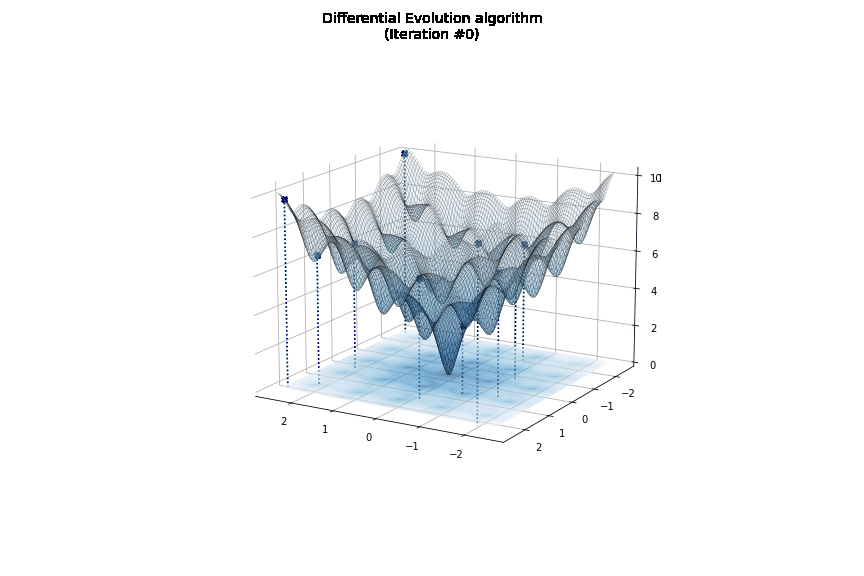
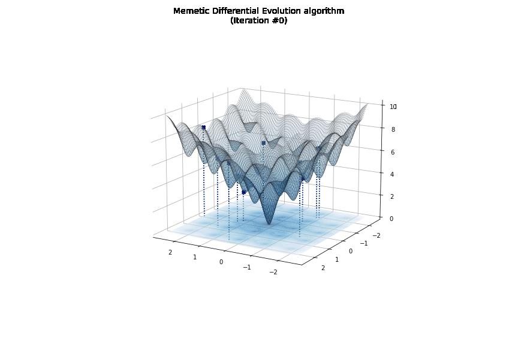
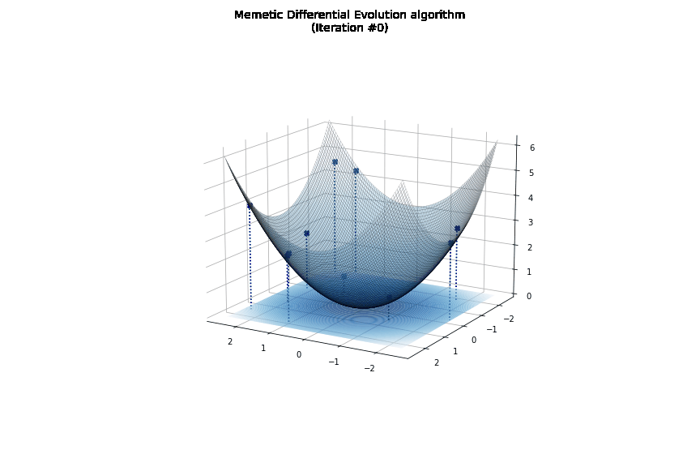

# goa (Global Optimization Animations)

`goa` helps visualise the execution of some global optimisation algorithms on a given problem.

It has been developed to fulfill the assignment of Optimization Methods, a computer engineering course taught at the University of Florence.

As of now, `goa` provides implementations of the following algorithms:
 - Memetic Differential Evolution (MDE)
 - Differential Evolution (DE)
 - Coordinate Method with Simple Descent Direction (CM)

## Installation
To install `goa`, run this command in your terminal:

```bash
$ pip install goa
```

## Usage

A command-line interface is available for quick (though limited) usage, just run this in your terminal:
```bash
$ python ./src/goa/cli.py
```
For full-fledged usage, the following is an application of (MDE)[] algorithm to the (Ackley)[https://en.wikipedia.org/wiki/Ackley_function] function that provide also a .gif of the algorithm exectution:

```python
from gop import problems, algorithms

problem = problem.Ackley(bounds=(-2.5, 2.5))
algorithms.memetic_differential_evolution(
  problem=problem,
  local_search_algorithm=algorithms.coordinate_method,
  animation_filepath='mde-animation.gif'
)
```
  


## Dependencies
 - python = ">=3.8,<3.11"
 - matplotlib = "^3.4.3"
 - numpy = "^1.21.2"
 - imageio = "^2.9.0"
 - imageio-ffmpeg = "^0.4.5"

## License
[MIT](https://choosealicense.com/licenses/mit/)

## Credits
The implementation of this package has had self-educational purpose and it has borrowed heavily from [yabox](https://github.com/pablormier/yabox).

## References
1. [Memetic differential evolution methods for clustering problems (Pierluigi Mansueto, Fabio Schoen)](https://www.sciencedirect.com/science/article/pii/S0031320321000364)
2. [Differential Evolution – A Simple and Efficient Heuristic for global Optimization over Continuous Spaces (Rainer Storn, Kenneth Price)](https://link.springer.com/article/10.1023/a:1008202821328)
3. [Metodi di ottimizzazione non vincolata (Luigi Grippo, Marco Sciandrone)](https://books.google.it/books?hl=en&lr=&id=wXyLzZahvmsC&oi=fnd&pg=PR3&dq=Metodi+di+ottimizzazione+non+vincolata&ots=p8vf3Hs9uT&sig=E5SS2SaeWCWt-ypCTImix0WV-Y4&redir_esc=y#v=onepage&q=Metodi%20di%20ottimizzazione%20non%20vincolata&f=false)
